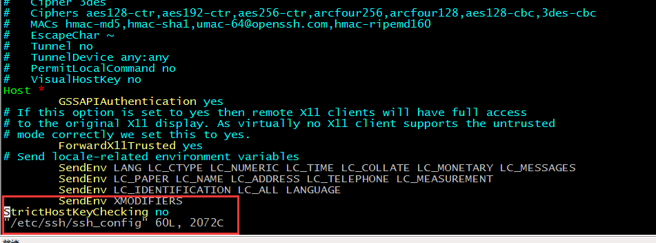
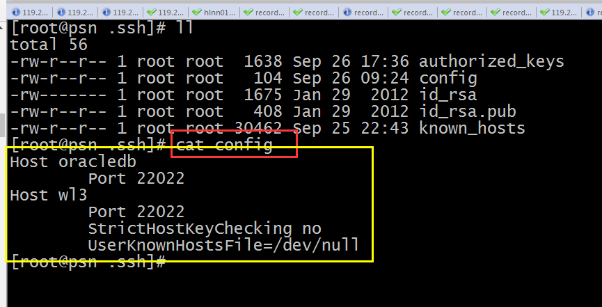

### 服务器通信拓扑结构图
```
                                                                                                                     host1

client -----------------ssh 登录 ------------------网关转发----------------- host2
                                                                                                                     host3
```  
##### 报错信息：client  knows-hosts中记录的是 网关的“指纹”，所以不能再连后续节点，总是报错

---  
#### 解决方法：
1   修改ssh  client 配置文件（此时，一定要修改文件的权限为  400）
```
$ vim $HOME/.ssh/config
StrictHostKeyChecking no
LogLevel quiet
```
2   连接的时候增加参数：
```
ssh -o StrictHostKeyChecking=no  -o LogLevel=quiet yourHardenedHost.com
scp -o UserKnownHostsFile=/dev/null -o StrictHostKeyChecking=no  -o LogLevel=quiet [remote user]@[remote_host]:/remote/path/to/send/file.zip
For DynDNS Names use ssh -o CheckHostIP=no. This is the best way. 对于动态DNS解析
```
3  禁止 ssh 读取这个配置文件
```
chmod 000 ~/.ssh/known_hosts
```
4   修改 ssh  client 登录节点的配置文件

